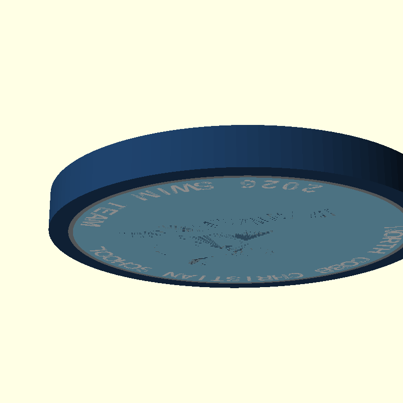

# NCCS 2026 Swim Team Challenge Coin

A 50mm, 4-color challenge coin for the **North Cobb Christian School 2026 Swim Team**, designed for single-print production on a Bambu P1S with AMS Pro 2. No glue. No assembly. One print, two faces.

| Obverse (Front) | Reverse (Back) |
|---|---|
|  |  |

---

## Design

### Obverse — NCC Shield Logo
The school's diamond shield in navy blue, surrounded by carolina blue field and a subtle gray accent ring.

- Navy blue diamond logo body
- White stylized NCC letterform inset into the diamond
- Carolina blue inner field
- Dark gray accent ring
- Navy blue outer rim

### Reverse — Swimmer + School Name
Swimmer silhouette over the school name arced in two directions.

- Navy swimmer silhouette centered in the carolina blue field
- **"NORTH COBB CHRISTIAN SCHOOL"** arced across the top in white
- **"2026 SWIM TEAM"** arced along the bottom in white
- Same gray accent ring and navy rim as obverse

---

## Colors

| AMS Slot | Color | Hex | Used On |
|---|---|---|---|
| 1 | Navy Blue | `#1B3B60` | Outer rim, obverse diamond, reverse swimmer |
| 2 | Dark Gray | `#999DA2` | Accent ring (swap for gold PLA to make it pop) |
| 3 | Carolina Blue | `#8BD1EE` | Inner field (both faces) |
| 4 | White | `#FFFFFF` | NCC letters (obverse), arc text (reverse) |

> **Tip:** Swapping slot 2 to a metallic gold PLA makes the accent ring stand out beautifully without any design changes.

---

## Specifications

| Parameter | Value |
|---|---|
| Diameter | 50 mm |
| Thickness | 5.0 mm |
| Relief height | 0.6 mm |
| Colors | 4 |
| Supports | None required |
| Layer height | 0.2 mm recommended |

---

## Print Instructions (Bambu Studio)

1. Open `build/NCCS_Challenge_Coin.3mf` in Bambu Studio 02.05+
2. Four filament slots auto-populate with correct color swatches
3. Assign your filaments:
   - Slot 1 → Navy Blue PLA
   - Slot 2 → Dark Gray PLA (or Gold for accent ring)
   - Slot 3 → Carolina Blue PLA
   - Slot 4 → White PLA
4. Print flat on build plate — no brim or supports needed

---

## File Structure

```
.
├── build.sh                  # Renders OpenSCAD → STL files + preview PNGs
├── create_3mf.py             # Packages STLs → Bambu-native 3MF
├── test_3mf.py               # TDD test suite (18 tests) for the 3MF builder
├── src/
│   ├── coin.scad             # Main double-sided coin model (all 4 colors)
│   ├── logo_diamond.svg      # Obverse: navy diamond body
│   ├── logo_border.svg       # Obverse: carolina border strokes
│   ├── logo_letters.svg      # Obverse: white NCC letterform
│   └── ref_swimmer.svg       # Reverse: swimmer silhouette
└── build/
    ├── coin_navy.stl         # Navy layer (rim + diamond + swimmer)
    ├── coin_gray.stl         # Gray layer (accent ring)
    ├── coin_carolina.stl     # Carolina layer (inner field, both faces)
    ├── coin_white.stl        # White layer (NCC letters + arc text)
    └── NCCS_Challenge_Coin.3mf  # Ready-to-print Bambu Studio project
```

---

## Rebuilding from Source

Requires [OpenSCAD](https://openscad.org/) and Python 3.

```bash
# Render all 4 color STLs + preview PNGs
./build.sh

# Package STLs into Bambu-native 3MF
python3 create_3mf.py

# Run the 3MF builder test suite
python3 -m pytest test_3mf.py -v
```

---

## Technical Notes

### Multi-Color Design: Zero Mesh Overlap

Each color layer is geometrically exclusive — no two meshes share any volume. The carolina blue base layer uses OpenSCAD `difference()` to subtract all other color shapes from itself. This prevents color bleed in the slicer.

### Double-Sided Single Print

Both the obverse and reverse are in one 5mm-thick coin body:
- **Obverse detail**: z = 4.4–5.0 mm (raised from the top face)
- **Reverse detail**: z = 0–0.6 mm (raised from the bottom face)

The coin prints once, flat on the build plate, with detail embossed on both faces.

### Reverse Face Mirroring

All reverse-face geometry is wrapped in `mirror([1, 0, 0])` in OpenSCAD so that logos and text read correctly when the coin is physically flipped over.

### Bambu Studio 3MF Format

The `.3mf` is built to Bambu's native spec:
- All 4 color meshes live in a single sub-model file (`3D/Objects/object_1.model`)
- Root model contains only an assembly wrapper with `p:path` component references
- `Application: BambuStudio-02.05.00.66` metadata triggers Bambu's native multi-color mode
- Filament colors are 6-digit hex in `Metadata/project_settings.config`

---

## Hardware Used

- Printer: Bambu P1S
- AMS: AMS Pro 2 (4 filament slots)
- Slicer: Bambu Studio 02.05.00.66

---

## License

This design is released for personal, non-commercial use. If you adapt it for another school or team, please share it back.
